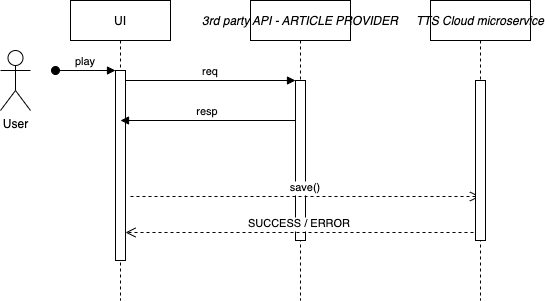

# tts-cloud
microservice for text to speech

## Overview diagram

## Architecture
- OPTION 1: CQRS (Command Query Responsibility Segregation) is used to separate erad and write operations; also aims to maintain a single source of truth
- OPTION 2: Event Sourcing

## Patterns
- SAGA orchestration and distributed transactions; helps in central coordination for rollbacks and commits

***
